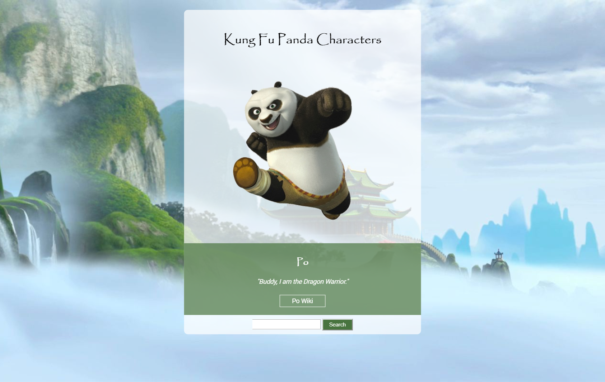

# web-dev-kfpanda
Design Resources for Kung Fu Panda Characters Web Page 

<h2>Screen Shot</h2>

<h2>Style Notes</h2>
<h3>FONTS</h3>
<ul>
  <li>base font is 'Roboto' (from Google Fonts)</li>
  <li>Main Heading and Character Name are 'Papyrus'</li>
  <li>All text is default size</li>
</ul>

<h3>COLORS</h3>
<ul>
  <li>white background is rgba(255, 255, 255, 0.7)</li>
  <li>green background is rgba(72, 116, 63, 0.7)</li>
  <li>Search button background is #48743F</li>
</ul>

<h3>LINKS</h3>

"Po Wiki" Link

<ul>
  <li>"https://kungfupanda.fandom.com/wiki/Po"</li>
  <li>On hover change background to white and text color to #48743F</li>
</ul>
